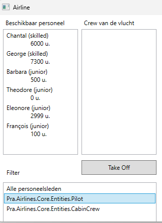

# Advanced classes: Airline

## Klassen

Er zijn reeds een aantal klassen aanwezig in de startsituatie. Bekijk deze klassen en probeer de code te begrijpen.

## Overlapping Pilot - CabinCrew

In de members van de klassen Pilot en CabinCrew is er veel overlapping. Je kunt dit oplossen door een superklasse te maken (bvb. Personnel)

### Personnel

Breng de volgende verfijning aan in Personnel

- Zorg ervoor dat er geen instances kunnen aangemaakt worden van Personnel zelf. Wel van Pilot en CabinCrew.
- De Id mag enkel beschikbaar zijn voor overervende klassen.
- Experience verschilt van invulling in de subklassen. Zorg ervoor dat het duidelijk is dat deze property hier geen invulling heeft, maar verplicht ingevuld moet worden in de subklassen.
- De constructor mag enkel beschikbaar zijn voor de subklassen.

### Pilot

- Erft over van Personnel.
- De setter van FlyingHours mag enkel bereikbaar zijn binnen het project Pra.Airlines.Core.
- Implementeer Experience (zie Personnel).
- Maak de constructor zo efficiënt mogelijk. Voorkom code duplicatie.
- Idem voor override ToString.

### CabinCrew

- Erft over van Personnel.
- De setter van FlyingHours mag enkel bereikbaar zijn binnen de klasse.
- Implementeer Experience.
- Maak de constructor zo efficiënt mogelijk. Voorkom code duplicatie.
- Idem voor override ToString.
- AddFlight mag enkel bereikbaar zijn binnen het project Pra.Airlines.Core.

### AirLine

- Houd al het personeel bij in één List. 
- Zorg ervoor dat de lijst met personeelsleden zo goed mogelijk beschermd wordt tegen ongewenste wijzigingen.
- Denk na over Pilots en CabinCrewMembers. Hoe kunnen dergelijke lijsten zo efficiënt mogelijk, dus zonder code duplicatie ter beschikking gesteld worden aan de gebruikers. Hou er rekening mee dat er wellicht nog andere personeelscategorieën kunnen bijkomen.
Pas CreatePersonnel aan.

### Code behind

Toon bij het opstarten alle personeelsleden in lstAvailableCrew.

#### **SeedLstFilter**

Vul lstFilter met de types Pilot en CabinCrew. Bovenaan komt de tekst 'Alle personeelsleden'.

#### **LstFilter_SelectionChanged**

Vul lstAvailableCrew met alle personeelsleden of een selectie ervan op basis van de gekozen klasse.

## GUI

De (wat onorthodoxe) GUI ziet eruit zoals hieronder getoond.

## Uitbreiding

- Voor het personeel wordt nu ook het loon bijgehouden (salary). Dit wordt ingesteld bij de instantiëring (willekeurig tussen 2500 en 3500). Daarna wordt het enkel gebruikt in de property **Career**.
- Via de property **Career** kan een overzicht opgevraagd worden van de carrière. Standaard is dit de naam en een indicatie van de hoogte van het loon.
  - Standaard: Piet (Regular)
  - Loon vanaf 3000: Jérôme (Big Shot)

- Bij piloten wordt het loon met 10 % verhoogd op het moment dat ze overgaan van junior naar skilled
  - Voeg een methode Fly toe. Die verhoogt het aantal vlieguren met de opgegeven hoeveelheid in de parameter.
  - Zorg dat skilled piloten meteen hun opslag krijgen bij aanwerving

- Bij piloten geeft de property **Career** geeft naast de naam en de hoogte van het loon ook het aantal vluchturen weer
> vb.
>
> Piet (Regular) 
> Vluchturen: 1500
